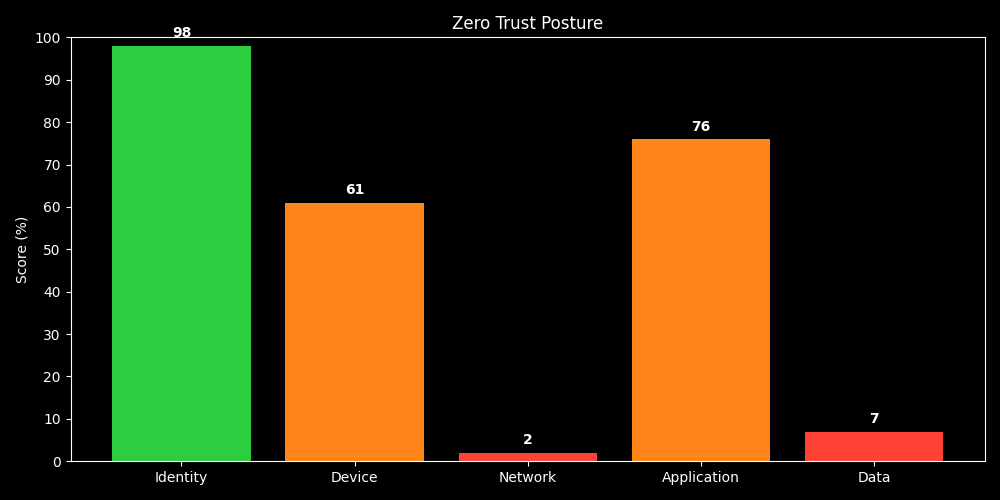
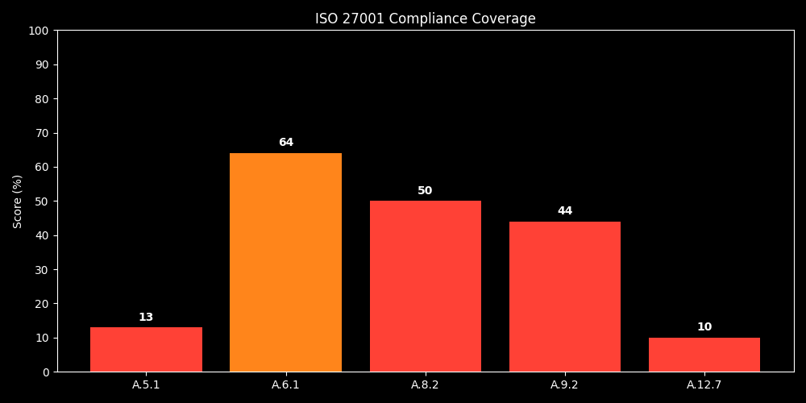
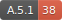
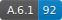
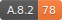
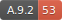
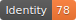

# 🔒 Zero Trust Dashboard

---

## 📝 Summary

The **Zero Trust Dashboard** provides a visual and automated view of your organization's **Zero Trust security posture** and **ISO 27001 compliance**. It refreshes twice daily to help analysts, leadership, and auditors quickly understand your security state.

---

## 🔍 Overview

The **Zero Trust Dashboard** provides an automated, real-time view of an organization's **Zero Trust security posture** and **ISO 27001 compliance**. It leverages **Python**, **SQLite**, and **GitHub Actions** to automatically update metrics, reports, badges, and visualizations twice daily.

- Provides consistent, auditable insights for operational and federal security teams.  
- Supports ongoing monitoring without manual intervention.  
- Ideal for ISO-27001 compliance tracking, OSINT analysis, and risk management audits.  

---

## 🛡️ Targeted Features
- **Zero Trust Posture Evaluation**: Continuous assessment across five critical domains — Identity, Device, Network, Application, and Data.  
- **ISO 27001 Compliance Monitoring**: Tracks coverage of key controls, highlighting gaps and compliance levels.  
- **Automated Daily Updates**: Graphs, badges, and reports are refreshed twice daily to reflect the latest data.  
- **Data-Driven Insights**: Supports actionable decision-making through real-time metrics.  
- **Demonstration and Testing**: Graphs and badges can be generated dynamically without affecting production outputs.  

---

## 📊 Key Metrics

### Zero Trust Domains
- **Identity**: Ensures secure access and user verification.  
- **Device**: Monitors security and health of endpoints.  
- **Network**: Protects against unauthorized access and ensures segmentation.  
- **Application**: Evaluates security vulnerabilities and patch compliance.  
- **Data**: Safeguards data integrity, encryption, and controlled access.  

### ISO 27001 Controls
- **A.5.1** – Information Security Policies  
- **A.6.1** – Organization of Information Security  
- **A.8.2** – Risk Management  
- **A.9.2** – Access Control  

---

## ⚙️ How It Works
- **📄 Data Storage**: Security metrics are stored in **SQLite** (`data/controls.db`).  
- **🗂️ Report Generation**: Produces structured reports summarizing current security posture and compliance.  
- **Visualizations**:  
  - **Graphs**: Dark-background graphs representing Zero Trust and ISO 27001 coverage, updated automatically twice daily.  
  - **Badges**: Real-time visual summaries of individual controls.  

> **⚠️ Note**: All graphs, badges, and metrics are refreshed daily to reflect the latest data.

---

## 📊 Security Dashboard 🗂️

### Latest Zero Trust Posture
- Updated daily, showing actionable insight for analysts and leadership.

  
  

### Real-Time Badges
- Summarizes individual control statuses with dynamic updates.

  
  
  
  
  
  
  
  
  

### 🗂 Metrics Table
| Control | Domain | Score (%) |
|---------|--------|-----------|
| A.5.1 | InfoSec Policies | 63 |
| A.6.1 | Org InfoSec | 45 |
| A.8.2 | Risk Management | 32 |
| A.9.2 | Access Control | 82 |
| Application | Application | 98 |
| Data | Data | 80 |
| Device | Device | 27 |
| Identity | Identity | 64 |
| Network | Network | 78 |

## 🚦 Color Codes

| Color    | Meaning                                  |
|----------|-----------------------------------------|
| 🔴 Red   | Critical (0-59%) / Non-compliant / Missing |
| 🟠 Orange| Warning (60-79%) / Partial / In Progress   |
| 🟢 Green | Healthy (80-100%)                        |
| 🔵 Blue  | Compliant / Covered ISO                  |
