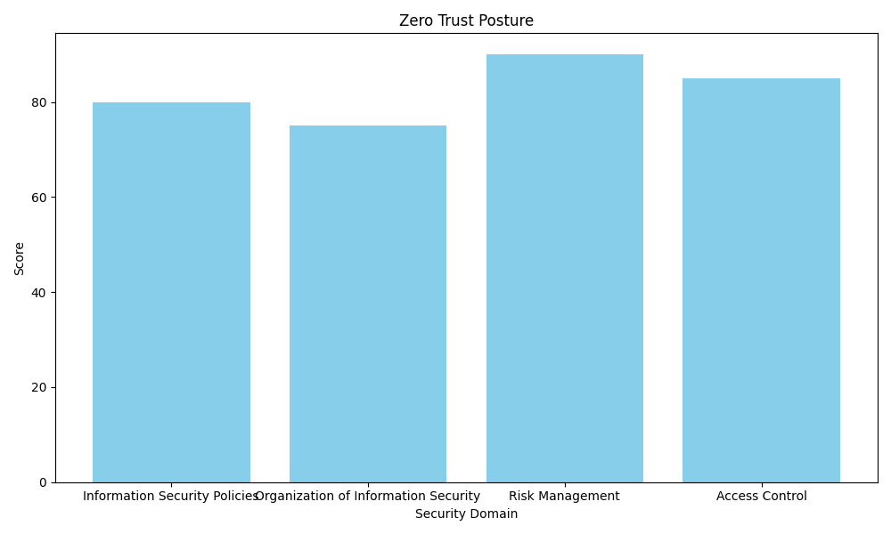
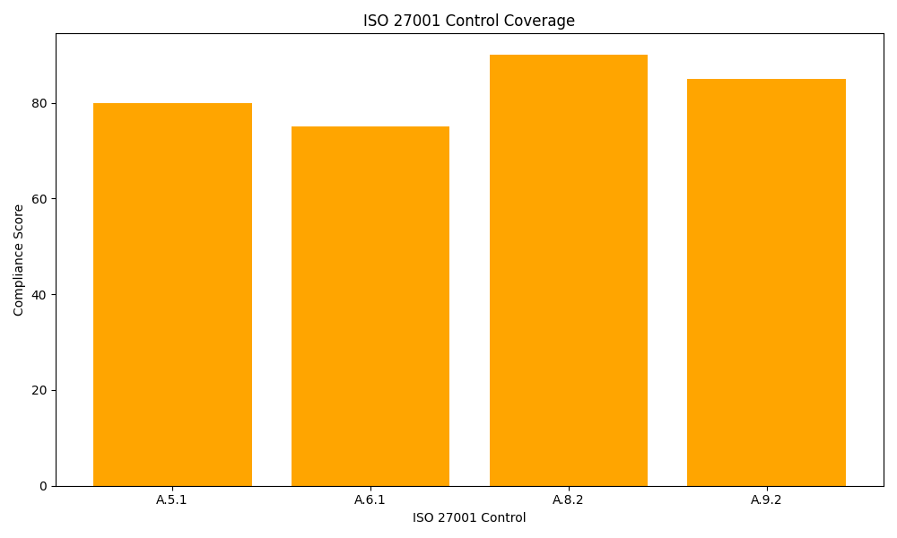

# 🔒 Zero Trust Dashboard

## 📂 Overview
The **Zero Trust Dashboard** provides an automated, real-time view of an organization's **Zero Trust security posture** and **ISO 27001 compliance**. By utilizing **Python**, **SQLite**, and **GitHub Actions**, this project ensures up-to-date metrics, reports, and visualizations with minimal manual effort, enabling security teams to monitor compliance effectively and proactively address potential risks.

## 🛡️ Key Features
- **Zero Trust Posture Evaluation**: Regular assessments across **5 key security domains**—Identity, Device, Network, Application, and Data—enabling continuous monitoring of security controls.
- **ISO 27001 Compliance**: Tracks adherence to **ISO 27001** controls, offering insights into your organization’s security practices and compliance gaps.
- **Automated Daily Updates**: All metrics, graphs, and badges are updated automatically twice a day, ensuring reports reflect the latest security status.
- **Data-Driven Insights**: The dashboard leverages a **SQLite** database and **Python** scripts to process real-time data and generate actionable security insights.

## 🔑 Key Metrics
### Zero Trust Domains
- **Identity**: Manages secure access and identity verification, ensuring that only authorized users gain access to critical resources.
- **Device**: Tracks the health and security of all devices, ensuring endpoints are secure and up-to-date.
- **Network**: Monitors secure network architecture and segmentation, preventing unauthorized access and ensuring safe data transfer.
- **Application**: Assesses the security of applications, identifying vulnerabilities and ensuring patches are applied.
- **Data**: Ensures data integrity, encryption, and secure access management, safeguarding sensitive information.

### ISO 27001 Controls
- **A.5.1** - Information Security Policies
- **A.6.1** - Organization of Information Security
- **A.8.2** - Risk Management
- **A.9.2** - Access Control

## 🌐 How It Works
- **Data Storage**: All security and compliance data is stored in the **SQLite database** (`data/controls.db`).
- **Report Generation**: Dashboards and reports are generated automatically and saved to `latest_report.md` for easy access.
- **Badges & Graphs**: 
  - **Badges**: SVG badges for Zero Trust and ISO 27001 compliance are stored in `assets/badges/`.
  - **Graphs**: Visual representations of security metrics are saved as PNG files in `assets/graphs/`.
> **⚠️ Note**: Graphs are updated twice daily to reflect the latest data.

## 🕵️‍♂️ Security Audit & Compliance
This dashboard is an essential tool for conducting **security audits**. It helps security teams:

- **Track Compliance**: Easily monitor the status of security controls across the organization.
- **Identify Gaps**: Pinpoint areas where security measures are insufficient or non-compliant.
- **Prepare for Audits**: Generate comprehensive reports that can be used for internal and external audits.

### Pro Tip:
Customize the dashboard to focus on specific controls, thresholds, or metrics that align with your organization's security priorities.

## 📊 Dashboards & Badges
### Latest Zero Trust Posture

### Latest ISO 27001 Control Coverage

### Real-Time Badges
  
  
  

## ⚙️ Key Files
- **`scripts/`**: Python scripts for generating dashboards, badges, and graphs.
  - **`create_controls_db.py`**: Initializes or updates the SQLite database (`data/controls.db`).
  - **`update_dashboard.py`**: Generates and updates the security report in `latest_report.md`.
  - **`generate_badges.py`**: Creates SVG badges for Zero Trust and ISO 27001 controls.
  - **`generate_graphs.py`**: Generates real-time graphs for Zero Trust posture and ISO 27001 compliance.

- **`assets/`**: Stores visual assets.
  - **`badges/`**: SVG badges for key security controls and domains.
  - **`graphs/`**: PNG graphs that visualize security posture and compliance data.

- **`data/controls.db`**: SQLite database that stores all security and compliance metrics.

## 📜 License
This project is licensed under the MIT License. For more details, see the [LICENSE](LICENSE) file.
